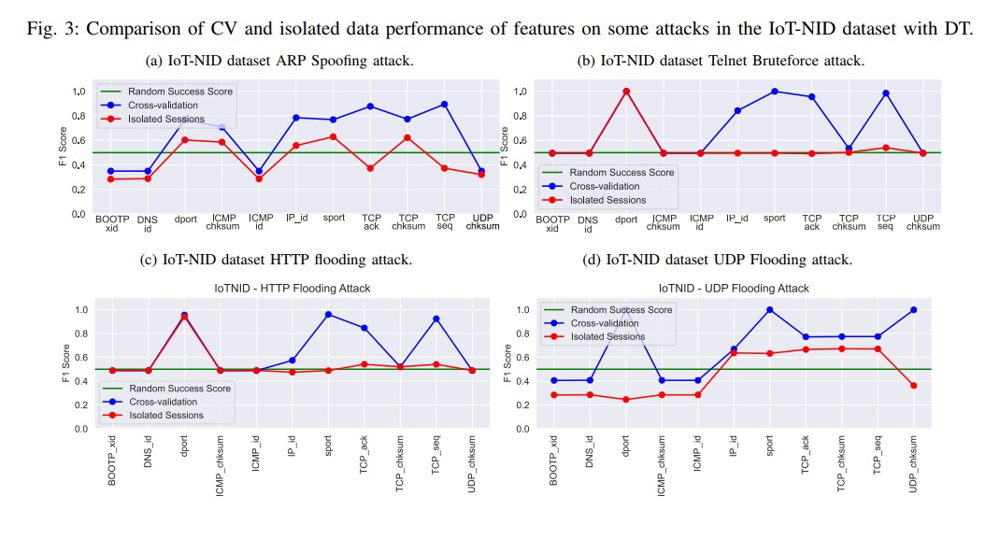
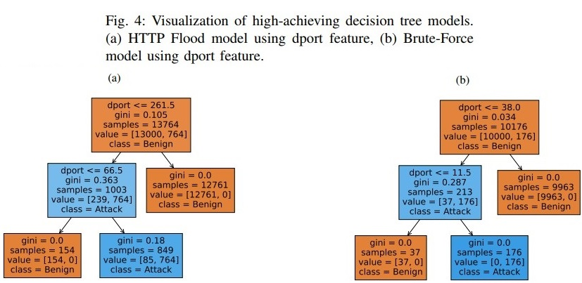
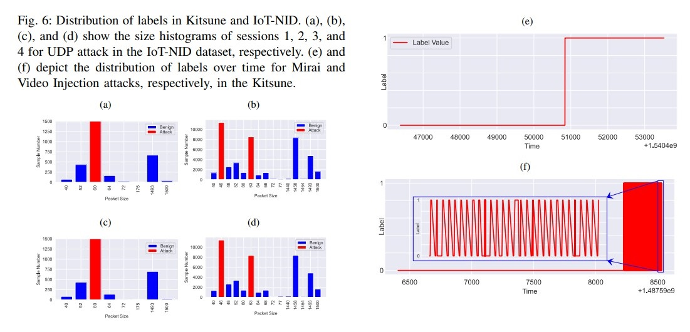
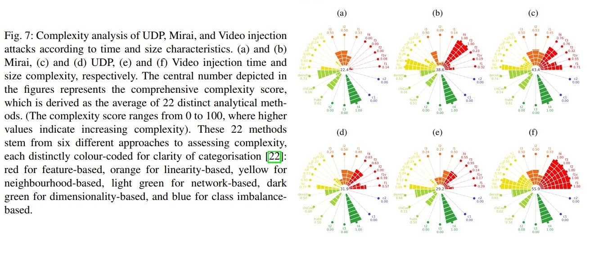
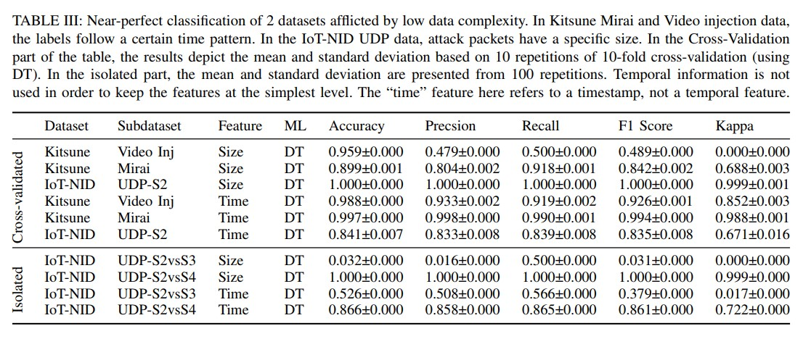
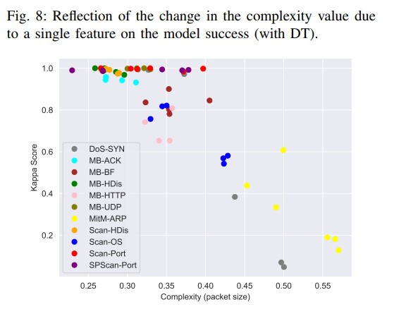

# Individual Packet Features are a Risk to Model Generalisation in ML-Based Intrusion Detection.

# Overview
In this repository you will find a Python implementation of the methods in the paper [Individual Packet Features are a Risk to Model Generalisation in ML-Based Intrusion Detectionn](https://arxiv.org/abs/2406.07578)


# Abstract

Machine learning is increasingly used for intrusion detection in IoT networks. This paper explores the effectiveness of using individual packet features (IPF), which are attributes extracted from a single network packet, such as timing, size, and source-destination information. Through literature review and experiments, we identify the limitations of IPF, showing they can produce misleadingly high detection rates. Our findings emphasize the need for approaches that consider packet interactions for robust intrusion detection. Additionally, we demonstrate that models based on IPF often fail to generalize across datasets, compromising their reliability in diverse IoT environments.


# Requirements and Infrastructure: 

Wireshark and Python 3.10 were used to create the application files. Before running the files, it must be ensured that [Wireshark](https://www.wireshark.org/), [Python 3.10+](https://www.python.org/downloads/) and the following libraries are installed.

| Library | Task |
| ------ | ------ |
|[ Sklearn ](http://scikit-learn.org/stable/install.html)| Machine Learning & Data Preparation |
| [ Numpy ](http://www.numpy.org/) |Mathematical Operations|
| [ Pandas  ](https://pandas.pydata.org/pandas-docs/stable/install.html)|  Data Analysis|
| [ Matplotlib ](https://matplotlib.org/users/installing.html) |Graphics and Visuality|
| [Seaborn ](https://seaborn.pydata.org/) |Graphics and Visuality|


## Datasets
The datasets we used in our study are listed below.

| Dataset | capture year | Number of Devices | Number of Attacks  |
|---|---|---|---|
|[IoT-NID](https://ocslab.hksecurity.net/Datasets/iot-network-intrusion-dataset)|2019|2|10|
|[Kitsune](https://www.kaggle.com/datasets/ymirsky/network-attack-dataset-kitsune)| 2019|9|9|


## Data Preparation / Feature Extraction

This study utilizes two datasets: the IoT-NID dataset and the Kitsune dataset. Below are the steps to prepare these datasets for machine learning (ML) operations.

### IoT-NID Dataset Preparation

   - The original IoT-NID dataset does not include labels but provides rules for creating them (see the rules in `IoT_NID-dataset_description.csv`).
   - Use the `010-IoT-NID_Label_Creator.ipynb` notebook to generate labels based on these rules.


### Kitsune Dataset Preparation

- The Kitsune dataset comes with pre-existing label files.
- Ensure that these files are named correctly and that the column containing the labels is named "Label".


### Feature Extraction and Labeling:
   - The `011-Features_Extraction.ipynb` notebook generates CSV files from raw network files (pcaps) for use in ML operations.
   - During feature extraction, if a CSV file with the same name as the pcap file exists in the same directory, the notebook will also perform the labeling process using this CSV file.
   - **Recommendation:** Create a folder containing both the pcap files and their corresponding label files, then run the `011-Features_Extraction.ipynb` notebook.

By following these steps, you will prepare both the IoT-NID and Kitsune datasets for further analysis and machine learning operations.


## Experiments

Section **IV. EXPERIMENTAL CASE STUDIES** contains the experiments conducted in this study.
-----------------------------
### 020.IPF-Compare-CV-Isolated.ipynb:
In Section **IV.A**, supported by Fig. 3, the discussion focuses on data leakage during the use of session-based features. To illustrate the cases with and without data leakage, experiments have been conducted in the following manner:

1. **Isolated Sessions:**
   - Experiments were performed on two isolated sessions to observe the effects of data leakage.

2. **Cross-Validation with Merged Sessions:**
   - Experiments were also carried out using cross-validation, which involved merging the two sessions.
   - The merging of the files used in the cross-validation process was done using the `021.CSV_Merger.ipynb` notebook.


   


### 030.Create-Model-Trees.ipynb:
In some of the isolated sessions in `Fig.3`, it is evident that some features perform quite well even though the session is isolated. To better understand this, the models with these specific cases are visualized as decision trees in `IV.A`, `fig.4`. 
   

### 040.IPF_histograms.ipynb
Section `IV.B` mentions that there are many uniform packets at the time of the attack. This section includes `Fig. 6`, which supports this data. Histograms of the data that form the basis for these graphs are created in this file.

   


### 050.IPF-Complexity.ipynb
In Section `IV.B`, `Fig. 7` shows that some attacks have very low complexity in terms of certain characteristics, as demonstrated by a complexity analysis graph. This file generates these graphs.
   

### 060.IPF-Final-evaluation.ipynb
`Table III` in Section `IV` presents the final experimental results. In this table, score comparisons are made between CV and isolated files. These comparisons also consider similar and dissimilar sessions for the same attack within the same dataset. This file generates these table scores.
   

### 061.IPF-All-attacks-complexity-vs-FScore
The last paragraph of Section `IV` discusses the impact of complexity on success and presents `Fig. 8` to support this. This graph is generated using this file.

&nbsp;&nbsp;&nbsp;&nbsp;&nbsp; 
 
# License
This project is licensed under the MIT License - see the [LICENSE](LICENSE) file for details


# Citations
If you use the source code please cite the following paper:

*Kahraman  Kostas,  Mike  Just,  and  Michael  A.  Lones.   Individual Packet Features are a Risk to Model Generalisation in ML-Based Intrusion Detection., arXiv preprint, arxiv:2406.07578, 2024*


```
@misc{kostas2024IPF,
      title={Individual Packet Features are a Risk to Model Generalisation in ML-Based Intrusion Detection.}, 
      author={Kahraman Kostas and Mike Just and Michael A. Lones},
      year={2024},
      eprint={2406.07578},
      archivePrefix={arXiv},
      primaryClass={cs.CR}
}
```

Contact:
*Kahraman Kostas
kahramankostas@gmail.com*
